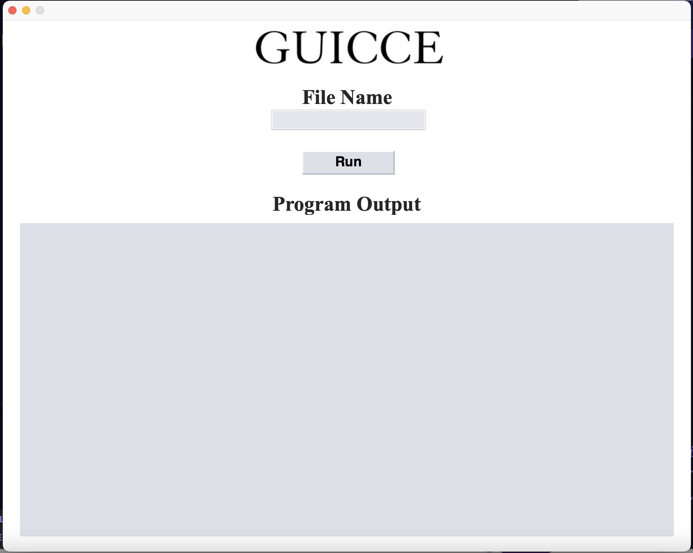

<h1 align="center"></h1>

<h3 align="center">A simple GUI for running C programs with gcc on MacOS.</h3>
<h3 align="center"><strong>But Why?</strong>  
Becauseeeeee... JK. I built it for those that have yet to master the treacherous terrain of the command-line, but have taken on the noble quest of learning programming, specifically C Programming, that requires a compiler. If one does not possess the knowledge of the mighty Terminal, then one is condemned to the IDE instead of the joys and freedom that gcc provides. This is the bridge to such a place friends. Build it.. and they will come... maybe. Oh well.
</h3>
<h3 align="center">
  Written by Kaycee Ingram  
  { kazewaze }
</h3>

 

<h3 align="center">UI Preview <em>(Instructions to get rollin are below that gorgeous UI... that's right, I said what I said..)</em></h3>

  

<h3 align=center>See? I ain't no liar!  To get up and running, do the following:</h3>
<ol>
  <li>Make sure you have Python Installed and do so if you don't.</li>
  <li>Clone or download the project to your local system.</li>
  <li>Once you navigate to the project in your terminal, use <strong>pip</strong> to install <strong>wx</strong> like so: <code>pip install wx</code></li>
  <li>Now run that bad boy like so: <code>python guicce.py</code></li>
</ol>

<h3>Remember that once it's running, the File Name Input only requires the <strong>file name</strong> that matches it's Dir like this example:</h3>

<h3><code>C_Programs / Ch1 / ch1.c</code> - The file name matches it's Parent Dir but it's lowercase instead of capitalized. When you enter the file name, leave it all lowercase and GUICCE will do the rest! <strong>So to run ch1.c you'd type:<strong> <code>ch1</code> into the File Name Text Input. And that's the show! Have uh Goodin!</h3>

<h3>Sincerely yours, like it or not, Kaycee Ingram</h3>